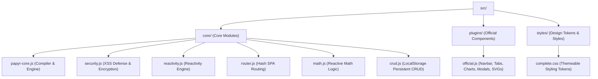

# 🤝 Contributing to Papyrus (papyr.js)

Welcome, developer! If you want to make frontend development simpler, faster, and more fun for developers worldwide (especially the next-gen creators), you are in the right place! 

This guide walks you through our high-speed modular architecture, build pipeline, design system, and testing rules so you can confidently contribute to Papyrus.

---

## 🏗️ Agile Modular Architecture (`src/` Directory)

Papyrus v3.0 has transitioned from a single-file codebase to a modular, highly scalable codebase located entirely under the `src/` folder. This ensures clean separation of concerns and lets multiple developers collaborate concurrently.



### 1. File Responsibilities
* **`src/core/papyr-core.js`**: Core compiler, selector parser (ID & class tokenization), tag spellcheck debugger, DOM mounting utilities, framework CDN loaders, and legacy namespace `papyr.noConflict()` implementation.
* **`src/core/security.js`**: Papyrus Security Kernel with enterprise-grade XSS sanitizers, pseudo-protocol interception, and standard client-side XOR+Base64 state vault encryption APIs (`papyr.storage.secureSet` / `papyr.storage.secureGet`).
* **`src/core/reactivity.js`**: Vue/SolidJS-style dependency tracking framework containing `state`, `computed`, reactive DOM trackers, and dependency collector effects.
* **`src/core/router.js`**: Single-page application (SPA) routing based on url `location.hash` with wildcards and programmatic hooks.
* **`src/core/math.js`**: `papyr.math` computed operations. Automatically tracks and updates formulas (`sum`, `sub`, `mul`, `div`, `avg`, `percent`, `round`) reactively.
* **`src/core/crud.js`**: `papyr.crud` engine. Creates zero-config local database caches that synchronize CRUD operations (`create`, `read`, `update`, `delete`, `clear`) natively with `localStorage`.
* **`src/plugins/official.js`**: UI components, visual charts (canvas-based bar & ring charts), modals, tabs, autocomplete lists, toast managers, and high-performance SVG vector icons.
* **`src/styles/complete.css`**: Design tokens, dark mode gradients, glassmorphism layouts, variables, keyframe animations, mobile media-query breakpoints, and custom layout systems (`.crud-grid`, `.responsive-split-grid`).

---

## ⚡ High-Speed Compiler Build Pipeline

We do not use Webpack, Rollup, or Vite for compilation. Instead, we use a zero-dependency automated compilation script `build.js` that compiles production bundles in **less than 10 milliseconds** using Node.js hrtime high-resolution metrics.

### Build Targets
1. **`papyr.js` (Core Bundle)**: Bundles only core compiler files in `src/core/` inside a secure IIFE closure. Ideal for lightweight layouts.
2. **`papyr-complete.js` (Complete Showcase Bundle)**: Combines all core files, official visual plugins, and auto-injects all CSS tokens from `src/styles/complete.css` so users can link one script and start coding immediately!
   * **CDN Link:** `https://papyrus-js.vercel.app/papyr-complete.js`

### How to Compile
Run the compiler from the root of the project:
```bash
node build.js
```

---

## 🎨 Design Aesthetics & Premium Tokens

To maintain our viral premium dark mode aesthetic, all styles, icons, and themes must align with the following rules:

1. **Color Palette (HSL Tailored CSS Variable System)**:
   * **Primary Accent**: Electric Violet/Blue (`--primary`: `#6366f1`)
   * **Secondary Accent**: Electric Teal (`--teal`: `#14b8a6`)
   * **Danger / Error Accent**: Rose Pink (`--rose`: `#f43f5e`)
   * **Background**: Sleek Deep Slate (`--bg-dark`: `#070913`)
   * **Surface Panels**: Semitransparent Obsidian (`--bg-card`: `rgba(16, 22, 42, 0.65)`)
2. **Visual Hierarchy (Glassmorphism)**:
   * Apply high-end glass backdrop filters (`backdrop-filter: blur(20px);`) combined with ultra-thin border outlines (`border: 1px solid rgba(255, 255, 255, 0.06)`).
3. **Typography**: Use modern geometric typography (`Outfit` and `Fira Code` fonts via Google Fonts CDN). Avoid serif browser defaults.
4. **SVG Icons**: Utilize optimized, inline SVG vector shapes via `papyr.icon(name, options)` instead of emojis for clean rendering on high-DPI retina screens.

---

## 🧪 Code Verification

Quality assurance is paramount. Before submitting a Pull Request, ensure that your modifications compile perfectly:
```bash
node build.js
```

### Contribution Guidelines
* **XSS Defense**: Never use `innerHTML` directly. Always use the core compiler's secure element creator or `papyr.security.sanitize` which strips malicious `<script>` triggers and inline event handler exploits.
* **State Mutability**: Maintain reactive principles. Modify reactive state values by setting the `.value` property (e.g., `myState.value = newValue`) rather than reassigning variables.
* **Namespace Protection**: Use `papyr.noConflict()` support for multi-library scenarios to make sure our namespace doesn't block developers already using `window.papyr`.
* **Keep it Easy**: Code should be so intuitive that a developer can understand it within 2 minutes. Prioritize clean comments and comprehensive docstrings.

---

# ❤️ Support Papyr.js

Papyr.js is an open-source project focused on making web development
simpler, more expressive, and beginner-friendly.

If Papyr.js helped you build, learn, or prototype faster,
you can support the project here:

https://www.paypal.com/ncp/payment/FXUVK7HA9E6M2

<a href="https://www.paypal.com/ncp/payment/FXUVK7HA9E6M2"
   target="_blank"
   style="
      display:inline-flex;
      align-items:center;
      justify-content:center;
      padding:14px 24px;
      border-radius:18px;
      background:#0070ba;
      color:white;
      text-decoration:none;
      font-weight:600;
      font-family:Inter,sans-serif;
      box-shadow:0 10px 30px rgba(0,0,0,.2);
      transition:.3s;
   ">
   ❤️ Support Papyr.js
</a>

Papyr.js is developed independently to help students,
designers, and developers build modern web experiences faster.

Supporting the project helps improve:
- Documentation
- Animations
- Components
- Security systems
- Developer tools
- Offline-first support

Support here:
https://www.paypal.com/ncp/payment/FXUVK7HA9E6M2

---

Let's collaborate to build the fastest, simplest, and most aesthetic HTML library in the world! 🚀
