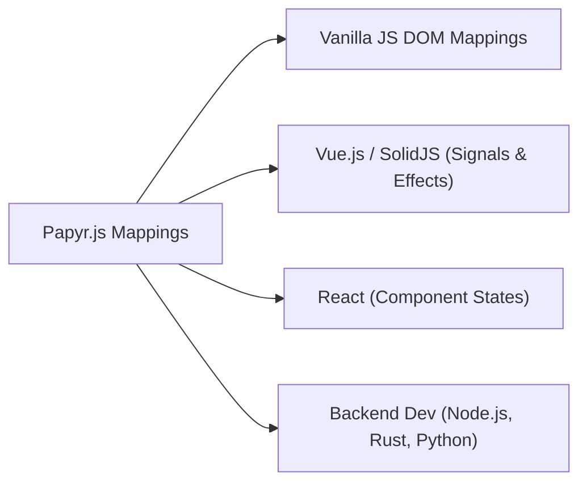
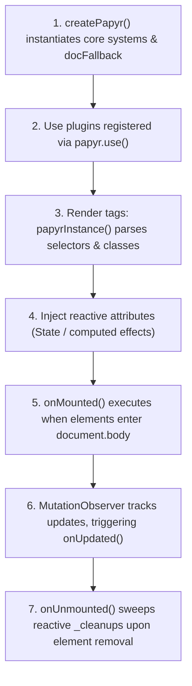

# 📘 Papyrus (papyr.js) Official Master Manual
> **Simple inside, Beautiful outside.**

Welcome to the official master documentation for **Papyrus (papyr.js)**—an ultra-lightweight, zero-overhead, highly expressive JavaScript library for crafting modern, secure, and reactive web applications without the complexity of traditional bundlers or virtual DOM engines.

---

## 📚 Table of Contents
1. [Core Philosophy](#1-core-philosophy)
2. [Fundamentals of DOM Creation](#2-fundamentals-of-dom-creation)
3. [Reactivity & Data Types](#3-reactivity-data-types)
4. [Control Flow Logic](#4-control-flow-logic)
5. [Standard DB CRUD Engine](#5-standard-db-crud-engine)
6. [Security, Obfuscation & WATT Enforcements](#6-security-obfuscation--watt-enforcements)
7. [AI & Speech Capabilities](#7-ai--speech-capabilities)
8. [Animations, Layouts & Inline Styling](#8-animations-layouts--inline-styling)
9. [Progressive Web Apps (PWA) & Offline Caching](#9-progressive-web-apps-pwa--offline-caching)
10. [Developer Tiers: Basics to Hackers](#10-developer-tiers-basics-to-hackers)
11. [Step-by-Step Practice Tutorials](#11-step-by-step-practice-tutorials)
12. [Debugging & Shifting to Other Languages](#12-debugging--shifting-to-other-languages)
13. [Reactivity Deep Dive: How It Works Without Virtual DOM](#13-reactivity-deep-dive-how-it-works-without-virtual-dom)
14. [Master API Reference Manual (31 Subsystems)](#14-master-api-reference-manual-31-subsystems)
15. [TypeScript Support Status](#15-typescript-support-status)
16. [Error Handling Patterns](#16-error-handling-patterns)
17. [Testing Guide](#17-testing-guide)
18. [Browser Compatibility Details](#18-browser-compatibility-details)
19. [Migration Guides from React/Vue/jQuery](#19-migration-guides-from-reactvuejquery)
20. [Memory Management & Leak Prevention](#20-memory-management--leak-prevention)
21. [Performance Characteristics](#21-performance-characteristics)
22. [GDPR & OWASP Security Framework](#22-gdpr--owasp-security-framework)
23. [Contributor Guide: Intelligent Web Runtime Kernel Lifecycle](#23-contributor-guide-intelligent-web-runtime-kernel-lifecycle)

---

## 1. Core Philosophy

Modern web development often utilizes build-heavy frameworks (such as React, Vue, or Angular) with virtual DOM diffing layers. Papyr takes a different, direct approach: it runs natively in the browser with zero compile steps, acting as a lightweight DOM building helper for vanilla JavaScript. It operates under two primary laws:
1. **Simple Inside**: Write direct DOM manipulations wrapped in highly intuitive, declarative parameter lists.
2. **Beautiful Outside**: Instant access to responsive flexbox/grid structures, beautiful themeable variables, and smooth physics-based transitions natively.

---

## 2. Fundamentals of DOM Creation

In standard Vanilla JS, creating elements involves repetitive calls to `document.createElement`, setting attributes, and manually appending children. Papyrus replaces this verbose boilerplate with **declarative tag creators**.

### Element Creation Syntax
Every standard HTML5 tag is exposed directly as a method on the `papyr` object (e.g., `papyr.div()`, `papyr.button()`, `papyr.input()`).

```javascript
// Simple Div with Text
let myDiv = papyr.div("Hello World!");

// Div with attributes and classes
let header = papyr.div(".header-title#main-header", 
    "Welcome to Papyr 🚀",
    {
        style: { color: "#6366f1", padding: "12px" },
        attrs: { role: "banner" }
    }
);
```

### The Selector Parser Syntax
You can define CSS classes and IDs directly inside the first string parameter of any element creator for instant mapping:
- `.my-class`: Adds a CSS class name.
- `#my-id`: Sets the element's ID attribute.
- `tag:content`: Instantly scaffolds a child element inside.

```javascript
let card = papyr.div(".card.shadow-lg#card-1",
    "h2:Premium Visual Card",
    "p:This card renders instantly without any template compilation step!"
);
```

### Mounting to the DOM
To display your compiled component tree, mount it to a target selector:

```javascript
let app = papyr.div(".app-wrapper",
    papyr.h1("Greetings from Papyr.js!")
);

papyr.mount("#app", app);
```

---

## 3. Reactivity & Data Types

Papyrus implements a fine-grained, dependency-tracking reactivity engine (inspired by Vue and SolidJS) that bypasses the Virtual DOM to apply **direct DOM updates** precisely where changes occur.

### A. Reactive State (`papyr.state`)
A reactive dataset wrapper. When the `.value` property is modified, all elements and computed nodes depending on it are updated instantly.

```javascript
let count = papyr.state(0);

// Subscribe to manual changes
let unsubscribe = count.subscribe((newValue) => {
    console.log("Counter is now:", newValue);
});

// Update value
count.value++;
```

### B. Computed Properties (`papyr.computed`)
Generates a read-only computed signal that automatically tracks other reactive state dependencies and recalculates only when those dependencies change.

```javascript
let price = papyr.state(100);
let tax = papyr.state(0.08);

let total = papyr.computed(() => {
    return price.value * (1 + tax.value);
});

console.log(total.value); // 108
price.value = 200;        // Automatically updates total to 216!
```

### C. Reactive Signals (`papyr.signal`)
An elegant alias to `papyr.state` matching modern state-management styles.

```javascript
let username = papyr.signal("Eldrex");
```

### D. Watchers (`papyr.watch`)
Triggers a callback immediately upon execution and subsequent reactive target modifications, passing both the new and old state values.

```javascript
papyr.watch(count, (newVal, oldVal) => {
    console.log(`Updated from ${oldVal} to ${newVal}`);
});
```

### E. Two-Way Data Binding (`papyr.model` / `papyr.bind`)
Eliminates input form sync boilerplate entirely.

```javascript
let message = papyr.state("Type here...");

// Inline creation binding (Boilerplate-free!)
let myInput = papyr.input("text", {
    ...papyr.model(message)
});

// Programmatic binding of an existing element
let existingInput = document.getElementById("search");
papyr.bind(existingInput, message);
```

### F. Predictive State Estimation (`options.predictive`)
For high-performance layouts, 3D panning, and drag/kinetic animations, pass `{ predictive: true }` to `papyr.state()` or call `papyr.predictiveState(val)`. It implements a Kalman filter and linear extrapolation to predict coordinates 2 frames (16ms) ahead.

```javascript
let cursor = papyr.predictiveState({ x: 0, y: 0 });

window.addEventListener('mousemove', (e) => {
    cursor.value = { x: e.clientX, y: e.clientY };
});

// Access predicted location 16ms ahead
console.log(cursor.predicted); // { x: ..., y: ... }
```

---

## 4. Control Flow Logic

Unlike virtual DOM frameworks, Papyrus uses direct DOM listeners to swap subtrees and reconcile lists efficiently with zero memory leaks.

### Conditional Rendering (`papyr.if`)
Swaps DOM subtrees dynamically based on the truthiness of a reactive state.

```javascript
let isLoggedIn = papyr.state(false);

let layout = papyr.div(
    papyr.if(isLoggedIn,
        () => papyr.button("Logout", { onclick: () => isLoggedIn.value = false }),
        () => papyr.button("Login", { onclick: () => isLoggedIn.value = true })
    )
);
```

### Keyed List Rendering (`papyr.for`)
Takes a reactive array state and efficiently renders elements in-place. If items are re-ordered or pushed, elements are reused rather than destroyed (perfect keyed reconciliation).

```javascript
let tasks = papyr.state([
    { id: "t1", name: "Write Docs" },
    { id: "t2", name: "Audit Core Code" }
]);

let todoList = papyr.ul(
    papyr.for(tasks, (task, index) => 
        papyr.li({ id: task.id }, task.name)
    )
);
```

*Note: Papyrus recursively disposes of reactive subscriptions and triggers `onUnmounted` lifecycle hooks automatically when elements are removed to prevent memory leaks.*

---

## 5. Standard DB CRUD Engine

Build data-heavy, offline-first dashboards effortlessly with our built-in persistence systems.

### A. Local Storage CRUD Store (`papyr.crud`)
Instantly constructs a reactive collection synchronized directly with `localStorage`.

```javascript
// Initialize CRUD collection
let todos = papyr.crud("my_todos", []);

// 1. Insert record (auto-generates Base36 unique IDs and timestamps)
let record = todos.create({ text: "Buy milk", done: false });

// 2. Read / Find
let target = todos.read(record.id);

// 3. Query (with sorting, filtering, and pagination offsets/limits)
let completed = todos.query({
    filter: { done: true },
    sort: { field: "createdAt", direction: "desc" },
    limit: 5,
    offset: 0
});

// 4. Update
todos.update(record.id, { done: true });

// 5. Delete
todos.delete(record.id);

// 6. Clear
todos.clear();
```

### B. Multi-Engine Unified DB (`papyr.db`)
Synchronize datasets natively with standard engines: `'local'`, `'session'`, `'indexeddb'`, `'sqlite'`, or `'firebase'`.

```javascript
// SQLite or IndexedDB storage
const offlineDB = papyr.db("customers", "indexeddb");

// Async operations
await offlineDB.insertAsync({ name: "Alice", rank: 1 });
let list = await offlineDB.listAsync();
```

### C. Database Engine Capabilities & Matrix

| Feature | local | session | indexeddb | firebase | sqlite |
|---------|-------|---------|-----------|----------|--------|
| Persistence | ✅ | ❌ (tab only) | ✅ | ✅ | ✅ |
| Capacity | ~5-10MB | ~5-10MB | ~50MB+ | Unlimited | ~50MB+ |
| Async | ❌ | ❌ | ✅ | ✅ | ✅ |
| Offline | ✅ | ✅ | ✅ | ❌ | ✅ |
| Sync | ❌ | ❌ | ❌ | ✅ | ❌ |
| Queries | Simple | Simple | Simple | Realtime | SQL |
| Setup | None | None | None | API Key | None |

#### Engine-Specific Configurations & Workflows
- **LocalStorage (`local`)**: Synchronous, ideal for tiny configurations, settings, or user preferences.
- **SessionStorage (`session`)**: Transient, active only for the duration of the browser tab session.
- **IndexedDB (`indexeddb`)**: High-capacity asynchronous object store built for offline-first data caching.
- **Firebase (`firebase`)**: Connects to dynamic remote cloud Firestore nodes for real-time document synchronization.
- **SQLite (`sqlite`)**: Accesses local relational SQL engines natively where Web SQL/SQL.js APIs are available.

---

## 6. Security, Obfuscation & WATT Enforcements

Papyrus takes privacy and application security seriously. It offers an elite, built-in **Web Access Transparency Toolkit (WATT)** system, cross-site scripting (XSS) filters, and local vaults to make sure user data stays safe from malicious browser extensions.

### A. Web Access Transparency Toolkit (WATT)
WATT is a secure browser interception network built into Papyrus's kernel. When active, WATT automatically intercepts browser storage write events and script injections:
- **Interception Keys**: Script sources and localStorage entries containing keywords like `_ga`, `_gid`, `_fbp`, `tracking`, `analytics`, or `pixel` are immediately trapped.
- **Privacy Tiers**: Set policy levels using `papyr.security.setTier(tier)`:
  - `'none'`: Interception is completely off.
  - `'default'`: Captures trackers only if the user hasn't actively granted consent via `setConsent(true)`.
  - `'high'`: Hard blocks all tracking dependencies and third-party scripts.

```javascript
// Set Standard Tier
papyr.security.setTier('default');

// Block tracking until consent is granted
papyr.security.setConsent(false); 

// Trackers like "_ga" are automatically sandboxed in a temporary, memory-only key storage!
localStorage.setItem('_ga', 'GA1.2.934892'); 
console.log(localStorage.getItem('_ga')); // Trapped and fetched from memory sandboxing!

// Granting consent
papyr.security.setConsent(true); // Flushes all sandboxed values safely back to real LocalStorage!
```

#### WATT Under the Hood (Technical Interception Layer)
WATT runs early inside the Papyrus kernel initialization sequence. It overrides the default browser storage APIs (`localStorage.getItem`, `localStorage.setItem`, `localStorage.removeItem`) with a Proxy layer. If WATT determines a storage key matches a tracking signature and consent is absent, the key is redirected to a temporary in-memory sandbox Map. When `setConsent(true)` is called, WATT automatically flushes all sandboxed memory keys into physical LocalStorage.

#### WATT Customization & Custom Prompt Gateways
Developers can customize WATT's styling parameters using `papyr.watt.configure()` or completely override WATT's prompt presentation logic to build custom floating banners, notifications, or drawer panels:

```javascript
// 1. Override labels and colors
papyr.watt.configure({
    branding: { title: "App Guard", primaryColor: "#4f46e5" },
    reason: "Requires user permission to track app activities."
});

// 2. Complete override with custom UI banner
papyr.watt.triggerWattPrompt = (capabilityName, onAllow, onDeny, permissions) => {
    const banner = papyr.div(".custom-banner", {
        style: {
            position: 'fixed', bottom: 0, left: 0, width: '100%',
            background: '#111827', padding: '16px', zIndex: 99999,
            display: 'flex', justifyContent: 'center', alignItems: 'center', gap: '16px', color: 'white'
        }
    },
        papyr.p(`App requests ${capabilityName}`),
        papyr.button("Grant", { onclick: () => { banner.remove(); onAllow(); } }),
        papyr.button("Deny", { onclick: () => { banner.remove(); onDeny(); } })
    );
    document.body.appendChild(banner);
};
```

### B. XSS Sanitizer (`papyr.security.sanitize`)
Blocks malicious script tags, pseudo-protocols (`javascript:`), and inline HTML event handler exploits (`onerror=`) from user inputs:

```javascript
let untrustedInput = "";
let safe = papyr.security.sanitize(untrustedInput); // Strips the onerror attribute completely!
```

#### XSS Protection: What's Actually Protected
- **Protected By Default**: All elements created using tag creators (e.g. `papyr.p()`, `papyr.div()`) automatically treat string arguments as text nodes rather than executable HTML. Attributes are bound using native `setAttribute` or object property assign, which completely prevents standard XSS vectors.
- **Manual Protection**: You should run untrusted user inputs through `papyr.security.sanitize(input)` before rendering or storing them.
- **Recommended Content Security Policy (CSP)**: Implement defense-in-depth by configuring a strict CSP header:
  ```html
  <meta http-equiv="Content-Security-Policy" 
        content="default-src 'self'; 
                 script-src 'self' https://papyrus-js.vercel.app; 
                 style-src 'self' 'unsafe-inline';">
  ```

### C. Local Storage Encrypted Vaults & Real Encryption

#### Synchronous Obfuscation Warning
> [!WARNING]
> The synchronous methods `papyr.storage.secureSet()` and `papyr.storage.secureGet()` use **XOR + Base64 obfuscation**. While useful for stopping casual inspection of LocalStorage on a client machine, this does **NOT** provide true cryptographic security or protection against dedicated memory scrapers.

#### Asynchronous Real Encryption (AES-256-GCM)
For sensitive keys, tokens, or personal identifiers, you **must** use the asynchronous Web Crypto API integrations:
```javascript
// ✅ Save securely using AES-GCM 256-bit with PBKDF2 key derivation
await papyr.storage.secureSetAsync("token", { jwt: "secret-data" }, "user-passphrase");

// ✅ Retrieve and decrypt
let decrypted = await papyr.storage.secureGetAsync("token", "user-passphrase");
```

### D. Biometric & Behavioral Adaptive UI
Papyr runs a passive background cadence tracker evaluating user input tempo:
- **`papyr.user.stress`**: Becomes `true` if mouse speed rises and changes direction erratically, or if mouse scroll/click rate spikes. This automatically toggles `.papyr-stress` on the document root, which scales button targets larger and disables background animations.
- **`papyr.user.reading`**: Becomes `true` if no user inputs are detected for 5 seconds during idle states. It toggles `.papyr-reading` on the root, adding line-height and kerning padding to typography to reduce visual fatigue.

```javascript
// Manually observe user focus states
papyr.user.stress.subscribe((isStressed) => {
    if (isStressed) console.log("User is erratically clicking/scrolling!");
});
```

### E. Prototype Pollution Mitigation Layer

To block prototype pollution attacks (CWE-94) dynamically, Papyr implements safe `Reflect` proxies on all element creations and attribute assignments. Instead of direct bracket notations (`el[key] = val`), the framework routes lookups through `Reflect.set` and `Reflect.get` while strictly filtering properties:
* Forbidden properties: `__proto__`, `constructor`, and `prototype`.
* Fallbacks created during SSR utilize `Object.create(null)` dictionaries to guarantee complete prototype safety.

### F. Regular Expression Denial of Service (ReDoS) Sanitizer

To mitigate ReDoS risks (CWE-185):
1. **Route Validator**: Route string patterns registered via `papyr.route()` and `papyr.page()` are checked against a strict character whitelist `/^[a-zA-Z0-9_/:.\-@~]*$/`. Any pattern containing regular expression metacharacters (such as `*`, `+`, `?`) is blocked to prevent backtracking exploits.
2. **NLP Parser**: Natural language schema parsers (`papyr.ai.toSemanticJSON`) scan string indices and positions rather than compiling dynamic schemas to `new RegExp`, eliminating regex processing overhead.

---

## 7. AI & Speech Capabilities

Develop high-speed interactive intelligence inside your static web runtimes. Papyrus includes native wrappers for speech, scans, and AI integrations.

### A. Speech Synthesis (`papyr.ai.speak`)
Speak text in real-time with pitch, volume, and voice configurations.

```javascript
papyr.ai.speak("Hello, welcome to Papyr.js!", {
    pitch: 1.0,
    rate: 1.0,
    volume: 1.0
});
```

### B. Speech Recognition (`papyr.ai.listen`)
Record voice inputs in the browser and translate them directly into strings.

```javascript
papyr.ai.listen({
    onResult: (text) => {
        console.log("User said:", text);
    },
    onError: (err) => {
        console.error("Speech recognition error:", err);
    }
});
```

### C. Semantic JSON structured payload builders (`papyr.ai.toSemanticJSON`)
Convert raw natural language structures to perfect, clean structured JSON data fields suitable for immediate API calls or LLM prompts.

```javascript
const structure = papyr.ai.toSemanticJSON({
    input: "Alice is 24 years old and works as a Software Engineer",
    schema: { name: "string", age: "number", profession: "string" }
});
console.log(structure); // { name: "Alice", age: 24, profession: "Software Engineer" }
```

---

## 8. Animations, Layouts & Inline Styling

Papyrus lets you format layouts using classic CSS stylesheets, CSS classes, inline styling objects, HSL-tailored configurations, or external styling networks.

### A. Inline Styling & Selector classes
Apply standard CSS styling configurations inside elements dynamically:

```javascript
let sidebar = papyr.div(".sidebar-panel", {
    style: {
        width: "280px",
        background: "rgba(16, 22, 42, 0.7)",
        backdropFilter: "blur(20px)",
        borderRight: "1px solid rgba(255, 255, 255, 0.06)",
        padding: "24px"
    }
}, "Sidebar Content");
```

### B. HSL Custom Theme Engines (`papyr.theme`)
Configure your application's CSS variables dynamically in JavaScript:

```javascript
papyr.theme({
    primary: "#6366f1",
    teal: "#14b8a6",
    surface: "rgba(16, 22, 42, 0.65)"
});
// Instantly maps --papyr-primary and --primary throughout your CSS variables!
```

### C. Breakpoint Responsive Utility Classes (`paper: [...]`)
Papyrus includes a responsive utility loader. Write grid variables that change automatically depending on breakpoints (`sm`, `md`, `lg`, `xl`):

```javascript
let cards = papyr.div({
    paper: ["grid", "rounded-xl", "sm:flex-col", "md:flex-row"]
});
```

### D. CSS/CDN Framework Loaders (`papyr.loadFramework`)
Load CSS files, TailwindCSS, or Bootstrap on-demand at runtime without build overhead:

```javascript
// Dynamic Tailwind loader
papyr.loadFramework('tailwind');

// Dynamic Bootstrap loader (automatically sets dark theme priorities)
papyr.loadFramework('bootstrap');
```

### E. Layout Orchestration Engine (`papyr.layout`)
Papyrus includes a high-performance **Layout Orchestration Engine** to scaffold responsive structural grids, foldable screen grids, persistent sidebars, dashboards, and cinematic hero panels instantly with zero layout shifts.

#### 1. Flex & Grid Layouts (`flex`, `grid`, `row`, `col`)
Quickly build alignment-safe wrappers. Shorthands resolve standard CSS layouts automatically:

```javascript
// Flex row alignment container
let nav = papyr.layout.row(
    papyr.div("Logo"),
    papyr.div("Links")
);

// Advanced Grid with responsive breakpoints
let gallery = papyr.layout.grid({
    cols: 'repeat(auto-fit, minmax(200px, 1fr))',
    gap: '24px'
}, 
    papyr.card("Item 1"),
    papyr.card("Item 2"),
    papyr.card("Item 3")
);
```

#### 2. Foldable Screen Adapter (`foldable`)
Dual-screen responsive alignment. Automatically splits layout horizontally or vertically if a viewport fold/hinge spans active screens (useful for Microsoft Surface Duo or foldable device viewports):

```javascript
// Splits into 2-columns on tablets/desktops; auto-folds to 1-column on folded viewports
let foldLayout = papyr.layout.foldable({ gap: '30px' },
    papyr.div("Left Wing / Main Editor"),
    papyr.div("Right Wing / Preview Panel")
);
```

#### 3. Persistent App Shell & Sidebar Dashboard (`dashboard`)
Scaffold complete enterprise-grade responsive admin dashboards with collapsible sidebars, mobile headers, content viewports, and auto-toggles in one call:

```javascript
let appShell = papyr.layout.dashboard({
    sidebarWidth: '260px',
    headerHeight: '60px',
    header: papyr.h2("Admin Portal"),
    sidebar: papyr.div(".nav-links",
        papyr.button("Dashboard", { onclick: () => papyr.navigate('/') }),
        papyr.button("Settings", { onclick: () => papyr.navigate('/settings') })
    ),
    main: papyr.router(), // Connects SPA router directly to the main viewport!
    footer: papyr.p("© 2026 Papyrus Isomorphic Inc.")
});

papyr.mount('#app', appShell);
```

#### 4. Cinematic Hero Sections (`hero`)
Generate high-impact intro cards complete with dynamic gradient texts, responsive action lists, and glassmorphic backing layouts:

```javascript
let intro = papyr.layout.hero({
    title: "Beautiful Outside, Simple Inside",
    subtitle: "Build isomorphic client-server reactive sites instantly",
    theme: 'indigo', // 'indigo' or 'teal' accent gradients
    glass: true,     // Enable frosted glass backdrop backing
    actions: [
        { text: "Get Started", primary: true, attrs: { onclick: () => papyr.navigate('/docs') } },
        { text: "Source Code", primary: false, attrs: { onclick: () => window.open('https://github.com') } }
    ]
});
```

#### 5. Frosted Glass Panels (`papyr.glass`)
Wrap standard DOM trees in frosted glass layers with physical high-blur filters:

```javascript
let glassPanel = papyr.glass(
    papyr.h3("Sensors Readout"),
    papyr.p("Backdrop blur active at 16px.")
);
```

#### 6. GPU-Accelerated WebGL2 Renderer (`papyr.layout.gpu`)
Offload layout structures to WebGL2 shader buffers using `papyr.layout.gpu(options, nodes)` to render thousands of dynamic graphic boxes, border radiuses, and shadow maps at 120 FPS using zero CPU cycles.

```javascript
let appLayout = papyr.layout.gpu({ width: 800, height: 600 }, [
    {
        x: 10, y: 10, width: 300, height: 200,
        color: [0.1, 0.2, 0.4, 1.0],
        borderRadius: 16,
        text: "Interactive GPU Panel",
        textColor: [1.0, 1.0, 1.0, 1.0]
    }
]);
```

---

## 9. Progressive Web Apps (PWA) & Offline Caching

Build professional, resilient, offline-first single-page applications with zero build steps or service worker boilerplates. Papyrus features a built-in PWA plugin to dynamically cache core bundle assets and user resources.

### A. Automatic Library Offline Pre-Caching
By default, initializing `papyr.pwa` automatically scans your document scripts to discover CDN links or local scripts referencing the Papyrus core distributions (`papyr-complete.js`, etc.) and downloads them to the browser's Cache Storage and IndexedDB caches:

```javascript
papyr.ready(() => {
    // Registers sw.js and pre-caches libraries + current pages in a one-liner
    papyr.pwa.init();
});
```

### B. Custom Offline Assets & Cache Names
You can pass custom assets to cache and specify custom sandboxed cache spaces:

```javascript
papyr.pwa.init({
    swPath: '/service-worker.js',
    cacheName: 'my-custom-vault-v1',
    assets: [
        '/',
        '/index.html',
        '/styles/main.css',
        '/assets/logo.png',
        'https://fonts.googleapis.com/css2?family=Outfit:wght@400;600&display=swap'
    ]
});
```

### C. Standard Service Worker Blueprint (`sw.js`)
To enable full offline intercepting, deploy a standard, tiny `sw.js` to your root path:

```javascript
const CACHE_NAME = 'papyr-pwa-cache';

self.addEventListener('install', (e) => {
    self.skipWaiting();
});

self.addEventListener('fetch', (e) => {
    e.respondWith(
        caches.match(e.request).then((cachedResponse) => {
            if (cachedResponse) return cachedResponse;
            return fetch(e.request).catch(() => {
                // Secondary IndexedDB query could be run here if desired
            });
        })
    );
});
```

### D. Self-Healing network cache mesh (`papyr.api.fetch`)
Replaces standard fetch wraps with offline resilience:
- **Relational Cache Mesh**: GET payloads are cached in background encrypted IndexedDB stores. If offline, the cache response is returned directly.
- **Deterministic Mutation Ledger**: Offline writes (POST, PUT, DELETE) are logged in local storage queues. They are simulated instantly in the UI, and automatically sync once a connection is re-established.

```javascript
// Cached and offline-resilient
let data = await papyr.api.fetch("https://api.my-endpoint.com/data");

// Offline mutation queued for automatic sync
await papyr.api.fetch("https://api.my-endpoint.com/posts", {
    method: "POST",
    body: { title: "Offline Post" }
});
```

---

## 10. Developer Tiers: Basics to Hackers

Papyrus supports developers across all learning scales:

### 🟢 TIER 1: BASICS (Tyros)
*Focus: Writing tags, rendering basic components.*
Create simple HTML structures, buttons, and titles instantly without build scripts or NPM configurations:

```javascript
let app = papyr.div(".basics-card",
    papyr.h2("Starting Out"),
    papyr.p("Writing HTML with zero tags boilerplate."),
    papyr.button("Click Me", { onclick: () => alert("Nice!") })
);
papyr.mount("#app", app);
```

### 🟡 TIER 2: INTERMEDIATE (Builders)
*Focus: State, computing, conditional views, and lists.*
Construct dynamic, reactive user portals that respond to inputs:

```javascript
let queryText = papyr.state("");
let listItems = papyr.state(["Apple", "Banana", "Orange"]);
let matches = papyr.computed(() => 
    listItems.value.filter(item => item.toLowerCase().includes(queryText.value.toLowerCase()))
);

let searchView = papyr.div(
    papyr.input("text", { placeholder: "Search fruits...", ...papyr.model(queryText) }),
    papyr.ul(
        papyr.for(matches, (fruit) => papyr.li(fruit))
    )
);
```

### 🔴 TIER 3: ADVANCED (Architects)
*Focus: Local persistent databases, math equations, and physics transitions.*
Engineers can build offline-first dashboards with automatic calculation updates:

```javascript
let sales = papyr.crud("monthly_sales", []);
let taxRate = papyr.state(0.12);

let totalRevenue = papyr.computed(() => 
    sales.list().reduce((sum, s) => sum + Number(s.amount || 0), 0)
);
let netIncome = papyr.math.sub(totalRevenue, papyr.math.mul(totalRevenue, taxRate));

// Smooth spring animation
let chart = papyr.div(".chart-bar", { style: { height: "0px", background: "teal" } });
papyr.mount("#app", chart);
papyr.animate(chart, { height: "200px" }, 800);
```

### 🔵 TIER 4: PRO (System Engineers)
*Focus: Mutators, lifecycle integrations, and performance tracing.*
Hook deep observers to lifecycle events, optimizing CPU cycles:

```javascript
let activeCount = papyr.state(0);

let observerWidget = papyr.div({
    // Lifecycle hooks
    onMounted: (el) => console.log("Widget rendered on DOM!"),
    onUnmounted: (el) => console.log("Widget destroyed, cleaning up subscriptions."),
    onUpdated: (el) => console.log("Attributes mutated, performing checks.")
}, () => "Active items: " + activeCount.value);

// Performance leak tracker
papyr.watch(activeCount, (val, old) => {
    console.log("Count changed from " + old + " to " + val);
});
```

### 💀 TIER 5: HACKERS (Overlords)
*Focus: Multi-library configurations, customized WATT sandboxes, dynamic Tailwind CDN adapters.*
Integrate side-by-side with vanilla JS, React, or jQuery without collisions:

```javascript
// Release the window.papyr namespace to avoid collisions in legacy environments
const corePapyr = papyr.noConflict(); 
// window.papyr is restored to its original value, while corePapyr holds the full framework!

// Inject a custom tracking script block rule dynamically
corePapyr.security.shouldBlockScript = (src) => {
    return src.includes("super-private-tracker.com");
};

// Bootstrap Tailind on-demand and construct elements dynamically
corePapyr.loadFramework("tailwind");
```

---

## 11. Step-by-Step Practice Tutorials

### Tutorial A: Reactive Math Counter (Basic-Intermediate)
Learn how to create reactive inputs, link variables, and perform calculations.

```html
<!DOCTYPE html>
<html lang="en">
<head>
    <script src="https://papyrus-js.vercel.app/papyr-complete.js"></script>
</head>
<body>
    <div id="calculator-app"></div>
    <script>
        let a = papyr.state(5);
        let b = papyr.state(10);
        let sumResult = papyr.math.sum(a, b);

        let App = papyr.div({ style: { padding: '24px', fontFamily: 'sans-serif' } },
            papyr.h2("⚡ Reactive Math Studio"),
            
            papyr.div(
                papyr.span("Value A: "),
                papyr.input("number", { ...papyr.model(a), style: { padding: '8px', margin: '4px' } })
            ),
            papyr.div(
                papyr.span("Value B: "),
                papyr.input("number", { ...papyr.model(b), style: { padding: '8px', margin: '4px' } })
            ),
            
            papyr.h3(() => "Result Sum: " + sumResult.value)
        );

        papyr.mount("#calculator-app", App);
    </script>
</body>
</html>
```

### Tutorial B: Secure Todo Vault with Local Encryption (Advanced)
A secure database app that encrypts key items in localStorage:

```html
<!DOCTYPE html>
<html lang="en">
<head>
    <script src="https://papyrus-js.vercel.app/papyr-complete.js"></script>
    <link rel="stylesheet" href="https://cdn.jsdelivr.net/npm/water.css@2/out/dark.css">
</head>
<body>
    <div id="todo-vault"></div>
    <script>
        // Encrypted localStorage storage wrapper
        const vaultKey = "secret-passphrase-123";
        let stored = papyr.storage.secureGet("my_vault_todos", vaultKey) || [];
        let items = papyr.state(stored);

        const syncVault = () => {
            papyr.storage.secureSet("my_vault_todos", items.value, vaultKey);
        };

        const addTodo = (text) => {
            if (!text) return;
            const entry = { id: Date.now().toString(), text };
            items.value = [...items.value, entry];
            syncVault();
        };

        const deleteTodo = (id) => {
            items.value = items.value.filter(item => item.id !== id);
            syncVault();
        };

        let App = papyr.div(
            papyr.h2("🔐 Encrypted Todo Vault"),
            papyr.p("All list items are fully encrypted inside your localStorage before writing."),
            
            papyr.input("text", {
                placeholder: "Add private item...",
                id: "vault-input",
                onkeypress: (e) => {
                    if (e.key === "Enter") {
                        addTodo(e.target.value);
                        e.target.value = "";
                    }
                }
            }),

            papyr.ul(
                papyr.for(items, (todo) => 
                    papyr.li(
                        papyr.span(todo.text + " "),
                        papyr.button("Delete", { onclick: () => deleteTodo(todo.id) })
                    )
                )
            )
        );

        papyr.mount("#todo-vault", App);
    </script>
</body>
</html>
```

### Tutorial C: Single Page App with Parameters & Routing (Pro-Hacker)
Build zero-setup modular routing:

```html
<!DOCTYPE html>
<html lang="en">
<head>
    <script src="https://papyrus-js.vercel.app/papyr-complete.js"></script>
</head>
<body>
    <div id="routing-app"></div>
    <script>
        // Define routes
        papyr.route("/", () => papyr.div("h2:🏠 Home Page", "p:Welcome to the routing hub."));
        papyr.route("/details", () => papyr.div("h2:📄 Details Page", "p:Explore specific specs."));
        papyr.route("/user/:name", () => {
            let params = papyr.useParams();
            return papyr.div(
                papyr.h2(() => "👤 User: " + params.value.name),
                papyr.p("Loaded from url hashes parameters dynamically!")
            );
        });

        // Scaffold App structure
        let App = papyr.div({ style: { padding: '24px', fontFamily: 'sans-serif' } },
            papyr.div({ style: { display: 'flex', gap: '12px', marginBottom: '24px' } },
                papyr.button("Home", { onclick: () => papyr.navigate("/") }),
                papyr.button("Details", { onclick: () => papyr.navigate("/details") }),
                papyr.button("User Alice", { onclick: () => papyr.navigate("/user/alice") }),
                papyr.button("User Bob", { onclick: () => papyr.navigate("/user/bob") })
            ),
            papyr.div({ style: { padding: '16px', border: '1px solid #ccc', borderRadius: '8px' } },
                papyr.router() // Yield active route views here
            )
        );

        papyr.mount("#routing-app", App);
    </script>
</body>
</html>
```

### Tutorial D: Dynamic Consent Banner enforcing WATT storage blocks (Hacker)
See how WATT filters storage, saving third-party tracking until consent:

```html
<!DOCTYPE html>
<html lang="en">
<head>
    <script src="https://papyrus-js.vercel.app/papyr-complete.js"></script>
    <style>
        .consent-banner {
            position: fixed; bottom: 20px; right: 20px;
            background: #1e293b; color: white; padding: 20px;
            border-radius: 12px; border: 1px solid #6366f1;
            max-width: 320px; box-shadow: 0 10px 25px rgba(0,0,0,0.5);
        }
    </style>
</head>
<body>
    <div id="watt-app"></div>
    <script>
        // Set standard tier. Sandbox tracking keys
        papyr.security.setTier("default");
        papyr.security.setConsent(false);

        // Try writing tracker inside cookie
        localStorage.setItem("_ga", "SANDBOXED_TRACKER_VALUE");
        console.log("Storage check before consent:", localStorage.getItem("_ga")); // Fetches from memory sandbox!

        let consentBannerVisible = papyr.state(true);

        let Banner = papyr.if(consentBannerVisible,
            papyr.div(".consent-banner",
                papyr.h3("🍪 Privacy Consent"),
                papyr.p("We use cookies to analyze web performance. Allow metrics?"),
                papyr.button("Accept All", {
                    onclick: () => {
                        papyr.security.setConsent(true); // Flushes metrics to localStorage!
                        consentBannerVisible.value = false;
                        console.log("Storage check after consent:", localStorage.getItem("_ga")); // Saved to real LocalStorage!
                    }
                })
            )
        );

        let App = papyr.div(
            papyr.h2("🛡️ WATT Tracking Sandbox Demonstration"),
            papyr.p("Watch your developer console to inspect sandboxing and storage shifts during interaction."),
            Banner
        );

        papyr.mount("#watt-app", App);
    </script>
</body>
</html>
```

---

## 12. Debugging & Shifting to Other Languages

One of the greatest features of Papyrus is that it acts as a **bridge to core engineering knowledge**. By using Papyrus, developers master the fundamental mechanics of standard JavaScript APIs, DOM trees, and data states. This sets up a frictionless learning curve to shift directly to other complex platforms.

### A. How Papyr.js Teaches Standard Web Fundamentals
1. **Spellcheck Debugger Typo Warnings**: 
   When write typos like `papyr.buton("Click")`, Papyrus automatically calculates the Levenshtein distance against allowed tags and throws warnings in console:
   `Unknown tag "buton". Did you mean "button"?`
   This actively guides beginners to learn standard native W3C HTML5 tags quickly.
2. **Standard DOM Tree Mappings**: 
   Since Papyrus does not use complex template parsing (`JSX`, `Svelte` syntax), every node created maps 1:1 to a real HTML element. Developers understand exactly what `parentElement.appendChild` or `classList` does under the hood.
3. **No-Magic Reactivity**: 
   Unlike magic compiler states, reactivity in Papyrus uses standard getters, setters, and Proxies. Understanding `.value` mutations prepares you directly to handle hooks in Vue, SolidJS, or Solid Signals.

### B. Shifting Path to Other Ecosystems



- **Shifting to standard Vanilla JS**: Simply map `papyr.tag()` to `document.createElement('tag')` and events to `element.addEventListener()`.
- **Shifting to Vue or SolidJS**: State patterns in Papyrus prepare you directly to use Vue's `ref()` / `computed()` and Solid's `createSignal()` / `createEffect()`.
- **Shifting to Backend Programming**: Working with async database queries (`queryAsync()`, sqlite, firebase) makes learning database models in **Node.js (Express)**, **Python (Django/FastAPI)**, or **Rust (Axum)** straightforward.

### C. Pythonic Syntax Bridge (`papyr.py`)
To make transitioning to web development even easier for developers coming from Python (e.g. Tkinter, Streamlit, Flet, PyWebIO), Papyr includes a dedicated `papyr.py` wrapper namespace. This allows building layouts using declarative, key-value property structures:

```javascript
const { Box, Text, Button, Input } = papyr.py;

const app = Box(
    { direction: "column", padding: 20, gap: 10, bg: "var(--papyr-surface)" },
    Text("Welcome to the Pythonic UI", { size: 24, weight: "bold" }),
    Button("Click Me", () => alert("Hello from Py-wrapper!"))
);
```

---

## 13. Reactivity Deep Dive: How It Works Without Virtual DOM

### Virtual DOM Frameworks (React, Vue)
Traditional frameworks recompute virtual DOM structures and perform diff computations to reconcile elements on every state trigger:
```text
State Change → Virtual DOM Diff → Recompute UI Nodes → Update Real DOM
```

### Papyrus Reactivity Model
Papyrus bypasses the virtual DOM entirely. It maps states directly to targets through a fine-grained, dependency-tracking subscription graph:
```text
State Change → Direct Targeted Node Mutator Action
```

When you write a reactive expression like `papyr.p(() => count.value)`, Papyrus runs the getter during mount, flags the active element as a dependency, and attaches it directly to the state's `subscribers` set. When the state `.value` is mutated, only the bound element's update handler executes, leaving the rest of the DOM tree completely untouched. This avoids full-page reconciliation calculations.

---

## 14. Master API Reference Manual (31 Subsystems)

This section maps the complete isomorphic API surface of all 31 sub-systems, core modules, and official capability plugins in the Papyr.js Intelligent Web Runtime Kernel.

### 🟢 Group A: Isomorphic Core & State Engines

#### 1. PAPYR CORE DOM ENGINE
*   **Signature**: `papyr(tag, ...args)`
*   **Description**: Declarative element builder supporting shorthand CSS class selectors, attribute dictionaries, dynamic reactive children, and isomorphic server-side DOM mock parsing (`docFallback`).
*   **Code Example**:
    ```javascript
    const card = papyr.div('.card#main',
        papyr.h1('Hello isomorphic DOM!'),
        { style: { padding: '20px' } }
    );
    ```

#### 2. PAPYR REACTIVITY SYSTEM
*   **Signature**: `papyr.state(initialValue)` / `papyr.computed(fn)` / `papyr.watch(node, callback)`
*   **Description**: Dynamic tracking state wrappers that run precise DOM updates precisely when values mutate, bypassing the Virtual DOM overhead.
*   **Code Example**:
    ```javascript
    let count = papyr.state(0);
    let double = papyr.computed(() => count.value * 2);
    papyr.watch(count, (newVal) => console.log('Count is:', newVal));
    ```

#### 3. PAPYR ROUTER
*   **Signature**: `papyr.route(path, renderer)` / `papyr.navigate(path)` / `papyr.useParams()`
*   **Description**: Lightweight, zero-config single-page hash routing gateway with dynamic path parameters support.
*   **Code Example**:
    ```javascript
    papyr.route('/profile/:id', () => {
        let params = papyr.useParams();
        return papyr.div(() => 'Loading Profile ID: ' + params.value.id);
    });
    ```

#### 4. PAPYR MATHEMATICAL LOGIC SYSTEM
*   **Signature**: `papyr.math.sum(a, b)` / `papyr.math.sub(a, b)` / `papyr.math.mul(a, b)`
*   **Description**: High-speed, auto-updating reactive calculators accepting standard numbers or dynamic state nodes.
*   **Code Example**:
    ```javascript
    let price = papyr.state(9.99);
    let totalWithTax = papyr.math.mul(price, 1.15); // Reactively recalculates if price shifts!
    ```

#### 5. PAPYR ORM SYSTEM
*   **Signature**: `papyr.model(stateOrData)` / `class MyClass extends papyr.component`
*   **Description**: High-level Object-Relational wrappers providing class definitions and two-way input reactive data-binding selectors.
*   **Code Example**:
    ```javascript
    let text = papyr.state('Edit me');
    let inputEl = papyr.input('text', { ...papyr.model(text) });
    ```

#### 6. PAPYR DEBUGGING SUITE
*   **Signature**: `papyr.debug(enable)` / `papyr.diagnostics.errors.push(err)`
*   **Description**: Built-in developer spellchecking warnings, performance bottleneck monitors, and diagnostic dashboards.
*   **Code Example**:
    ```javascript
    papyr.debug(true); // Enables spellcheck spell-typo observers throwing warnings
    ```

---

### 🟡 Group B: Storage, Database & Authentication

#### 7. PAPYR DATA SYSTEM
*   **Signature**: `papyr.db(collectionName, engine)`
*   **Description**: Unified database driver providing synchronous and asynchronous query wrappers for `'local'`, `'session'`, `'indexeddb'`, `'sqlite'`, and `'firebase'`.
*   **Code Example**:
    ```javascript
    const myStore = papyr.db('analytics_logs', 'indexeddb');
    await myStore.insertAsync({ id: 'log1', value: 42 });
    ```

#### 8. PAPYR CRUD STORAGE ENGINE
*   **Signature**: `papyr.crud(collectionName, initialData)`
*   **Description**: Auto-synchronizing reactive collection mapped directly to localStorage for rapid dashboard scaffolding.
*   **Code Example**:
    ```javascript
    let vault = papyr.crud('todos');
    let item = vault.create({ name: 'Write specs' }); // Auto-generates Base36 ID and timestamp
    ```

#### 9. PAPYR AUTHENTICATION ENGINE
*   **Signature**: `papyr.auth.init(config)` / `papyr.auth.login(credentials)`
*   **Description**: Unified authentication driver supporting local database registrations, JWT session expiration checks, and brute-force lockout safeguards.
*   **Code Example**:
    ```javascript
    papyr.auth.init({ provider: 'local' });
    papyr.auth.login({ username: 'user1', password: 'password' })
        .then(u => console.log('Active user:', u.username));
    ```

#### 10. PAPYR SECURITY KERNEL
*   **Signature**: `papyr.security.sanitize(html)` / `papyr.storage.secureSet(key, val, pwd)`
*   **Description**: Enterprise-grade cross-site scripting (XSS) sanitizer filters, and local feedback ciphers.
*   **Code Example**:
    ```javascript
    let xssPayload = "";
    let cleanHTML = papyr.security.sanitize(xssPayload); // Strips onerror exploit attribute
    ```

---

### 🔵 Group C: Styling, Layouts & Visuals

#### 11. PAPYR LAYOUT ENGINE
*   **Signature**: `papyr.layout.flex()` / `papyr.layout.grid()` / `papyr.layout.dashboard()`
*   **Description**: Zero-layout shift scaffolding containers (dashboard templates, flexible grids, foldable viewport adapters).
*   **Code Example**:
    ```javascript
    let mainDashboard = papyr.layout.dashboard({
        header: papyr.h2('Isomorphic Dashboard'),
        sidebar: papyr.div('Collapsible panel'),
        main: papyr.div('Active viewport')
    });
    ```

#### 12. PAPYR DESIGN ENGINE
*   **Signature**: `papyr.theme(colorsMap)` / `paper: [...]`
*   **Description**: Dynamic HSL CSS variable injection, theme mapping variables, and breakpoint utilities selectors.
*   **Code Example**:
    ```javascript
    papyr.theme({ primary: '#6366f1', surface: 'rgba(0,0,0,0.5)' });
    ```

#### 13. PAPYR ANIMATE
*   **Signature**: `papyr.animate.spring(el, props, conf)` / `papyr.animate.gesture(el, opts)`
*   **Description**: Hardware-accelerated transitions, kinetic spring physics, gestures touch trackers, and scroll observers.
*   **Code Example**:
    ```javascript
    papyr.animate.spring(myBtn, { scale: 1.2 }, { tension: 170, friction: 26 });
    ```

#### 14. PAPYR CHARTS
*   **Signature**: `papyr.charts(canvasId, conf)`
*   **Description**: Lightweight, high-performance HTML5 Canvas dynamic graphing, charts, and bar diagrams.
*   **Code Example**:
    ```javascript
    papyr.charts('my-canvas-id', {
        type: 'bar',
        data: [12, 19, 3, 5, 2]
    });
    ```

#### 15. PAPYR PARTICLES ENGINE
*   **Signature**: `papyr.particles(canvasEl, options)`
*   **Description**: Zero-dependency interactive HTML5 Canvas background particle system mapping nodes and vectors dynamically.
*   **Code Example**:
    ```javascript
    papyr.particles(myCanvas, { color: '#6366f1', speed: 1.5, density: 100 });
    ```

#### 16. PAPYR 3D / IMMERSIVE ENGINE
*   **Signature**: `papyr['3d'].scene(options, ...children)`
*   **Description**: High-performance, zero-dependency cinematic 3D scene orchestration. Detects Three.js globally, otherwise boots a gorgeous, pointer-aware Canvas2D perspective fallback. Supports `'space'`, `'cyberpunk'`, and `'underwater'` environments with motion parallax depth and particle systems.
*   **Code Example**:
    ```javascript
    // Space: Deep cosmic void with mouse-displacement starfield
    const spaceScene = papyr['3d'].scene({
        environment: 'space',
        particles: true,
        depth: true,
        overlay: papyr.div('.glass-card',
            papyr.h1('Cosmic Void'),
            papyr.p('Interactive starfield moving dynamically with your pointer.')
        )
    });

    // Cyberpunk: Synthwave wireframe vector horizon with glowing nodes
    const cyberScene = papyr['3d'].scene({
        environment: 'cyberpunk',
        particles: true,
        depth: true,
        overlay: papyr.div('.neon-card',
            papyr.h1('Cyber Horizon'),
            papyr.p('Cyberpunk wireframe grid with neon aesthetic sparks.')
        )
    });

    // Underwater: Shifting light shafts caustics and rising organic bubbles
    const oceanScene = papyr['3d'].scene({
        environment: 'underwater',
        particles: true,
        depth: true,
        overlay: papyr.div('.ocean-card',
            papyr.h1('Sub-aquatic Chamber'),
            papyr.p('Rising translucent bubbles drifting with shifting light rays.')
        )
    });
    ```

---

### 🟢 Group D: Hardware & System Gateways

#### 17. PAPYR SYSTEM & SANDBOX ACCESS ENGINE
*   **Signature**: `papyr.system.openFile(options)` / `papyr.system.notify(msg)`
*   **Description**: Sandboxed browser gateways wrapping File System Access Pickers, notifications, and clipboard streams.
*   **Code Example**:
    ```javascript
    const file = await papyr.system.openFile({ multiple: false });
    console.log('Opened file:', file.name);
    ```

#### 18. PAPYR NATIVE BROWSER APIs
*   **Signature**: `papyr.browser.geolocation()` / `papyr.browser.clipboard()`
*   **Description**: Bulletproof hardware abstraction wrappers to fetch location coordinates, hardware states, and sensor details.
*   **Code Example**:
    ```javascript
    const loc = await papyr.browser.geolocation();
    console.log('Latitude is:', loc.coords.latitude);
    ```

#### 19. PAPYR PWA ENGINE
*   **Signature**: `papyr.pwa.init(options)`
*   **Description**: Isomorphic progressive web app caching manager which pre-caches libraries and custom files in Cache Storage and IndexedDB.
*   **Code Example**:
    ```javascript
    papyr.pwa.init({ cacheName: 'admin-offline-v1' });
    ```

#### 20. PAPYR WATT SYSTEM
*   **Signature**: `papyr.watt.register(consentFn)`
*   **Description**: Web Access Transparency Toolkit transparent gateway intercepting localStorage writes and blocking unconsented scripts.
*   **Code Example**:
    ```javascript
    papyr.security.setConsent(false); // Sandboxes metric keywords in a memory-only store!
    ```

#### 21. PAPYR POWER SYSTEM
*   **Signature**: `papyr.power.state.subscribe(cb)`
*   **Description**: Energy-aware state performance loop throttler that scales down animation paces during idle states.
*   **Code Example**:
    ```javascript
    papyr.power.state.subscribe(stateVal => {
        console.log('Energy pacing state changed:', stateVal); // e.g. 'idle', 'active'
    });
    ```

---

### 🟡 Group E: AI, Documents, Science & Integrations

#### 22. PAPYR AI PLATFORM GATEWAY & PROMPT OPTIMIZER
*   **Signature**: `papyr.ai.toSemanticJSON({ input, schema })`
*   **Description**: Prompts template compiler, token-minimizer semantic serializers, and local structured LLM adapters.
*   **Code Example**:
    ```javascript
    const data = papyr.ai.toSemanticJSON({
        input: "Alice, age 30",
        schema: { age: "number" }
    }); // returns { age: 30 }
    ```

#### 23. PAPYR OCR & VOICE EXTRACTOR
*   **Signature**: `papyr.ai.speak(text)` / `papyr.ai.listen(options)`
*   **Description**: Native browser optical character recognition (OCR), web speech speech synthesizers, and real-time listens.
*   **Code Example**:
    ```javascript
    papyr.ai.speak("Hello contributors!");
    ```

#### 24. PAPYR DOCUMENT & CANVAS EXPORTER (PDF)
*   **Signature**: `papyr.pdf.export(element, name)`
*   **Description**: Zero-dependency vectorized PDF document compiler and DOM viewport element exporter.
*   **Code Example**:
    ```javascript
    papyr.pdf.export(document.getElementById('receipt-div'), 'Invoice_2026.pdf');
    ```

#### 25. PAPYR RIGID 2D PHYSICS SIMULATOR
*   **Signature**: `papyr.physics.verlet(element, config)`
*   **Description**: Zero-dependency 2D physical engine supporting Verlet integrations, rigid bounding blocks, drag forces, and elastic bounce rates.
*   **Code Example**:
    ```javascript
    papyr.physics.verlet(circleElement, { gravity: 0.98, bounce: 0.8 });
    ```

#### 26. PAPYR STEM, GRAPHING, & BUSINESS ACCOUNTING ENGINE
*   **Signature**: `papyr.science.graph(canvas, equation)`
*   **Description**: Responsive equations canvas plotting models, unit metrics conversions, and tax invoice computations.
*   **Code Example**:
    ```javascript
    papyr.science.graph(myCanvas, 'Math.sin(x)');
    ```

#### 27. PAPYR INTEGRATIONS ENGINE
*   **Signature**: `papyr.ssr(component)` / isomorphic IIFE loaders
*   **Description**: Official client-backend server-side rendering (SSR) interfaces, Node.js bindings, and React hook adapters.
*   **Code Example**:
    ```javascript
    // Returns rendered static HTML string from Node/Express server side!
    const html = papyr.ssr(papyr.div('.box', 'Server rendered'));
    ```

#### 28. PAPYR MACHINE LEARNING ENGINE
*   **Signature**: `papyr.ml.perceptron(options)`
*   **Description**: Browser-native perceptrons, training engines, and neural model helpers with zero external dependencies.
*   **Code Example**:
    ```javascript
    let brain = papyr.ml.perceptron({ inputs: 2 });
    brain.train([0, 1], 1);
    ```

#### 29. PAPYR API HELPERS
*   **Signature**: `papyr.api.get(url)` / `papyr.api.post(url, data)`
*   **Description**: Sane fetch shorthands supporting auto-JSON headers and timeout handlers.
*   **Code Example**:
    ```javascript
    let data = await papyr.api.get('https://api.github.com/users/octocat');
    ```

---

### 🔵 Group F: Contributor Architecture Gateways

#### 30. PLUGINS REGISTRY Lifecycle
*   **Hooks**: `install(kernel)` / `hooks.onInit()` / `hooks.onRender(element)`
*   **Description**: System plugin compiler life hooks supporting dynamic interface decorators and render watchers.
*   **Code Example**:
    ```javascript
    const myPlugin = {
        name: 'custom-renderer',
        hooks: {
            onRender(el) {
                console.log('DOM node parsed in runtime:', el.tagName);
            }
        }
    };
    papyr.use(myPlugin);
    ```

#### 31. COMPONENTS REGISTRY Lifecycle
*   **Hooks**: `onMounted(el)` / `onUnmounted(el)` / `onUpdated(el)`
*   **Description**: Kernel lifecycle listener monitoring nodes mounting to DOM, performing automated memory-leak cleans (`_cleanups`), and throttling idle update loops.
*   **Code Example**:
    ```javascript
    let widget = papyr.div({
        onMounted: (el) => console.log('Widget mapped on screen!'),
        onUnmounted: (el) => console.log('Widget removed, memory swept.')
    }, "Hello");
    ```

---

## 15. TypeScript Support Status

### Current Status (v3.0.1)
- **Pre-bundled Types**: TypeScript definitions (`.d.ts`) are officially pre-bundled and distributed inside the `@eldrex/papyr` core package.
- **VS Code autocomplete**: Active out of the box (resolved by the `"types": "./dist/papyr.d.ts"` field in `@eldrex/papyr`'s configuration).
- **Type Definitions Location**: Located at [papyr.d.ts](https://github.com/EldrexDelosReyesBula/PapyrusJS/blob/main/public/papyr.d.ts) in the workspace and exported to `/dist` directories.

---

## 16. Error Handling Patterns

Build highly resilient UI states by capturing runtime database issues, network interruptions, and element rendering failures.

### A. Database Storage Failures
```javascript
try {
    let tasks = papyr.crud("user_tasks");
    tasks.create({ title: "My Task" });
} catch (error) {
    if (error.name === "QuotaExceededError") {
        papyr.toast("Browser storage is full! Please clear items.", "error");
    } else {
        console.error("Storage failed:", error);
    }
}
```

### B. Async Network Retries with Exponential Backoff
```javascript
async function fetchWithRetry(url, retries = 3, delay = 1000) {
    for (let i = 0; i < retries; i++) {
        try {
            return await papyr.api.get(url);
        } catch (e) {
            if (i === retries - 1) throw e;
            await papyr.delay(delay * (i + 1)); // Exponential delay
        }
    }
}
```

### C. Component Error Boundaries
Prevent a single broken element or API fail from crashing your entire application:
```javascript
let stableUI = papyr.errorBoundary(
    () => papyr.div(".widget", () => "Data: " + rawInput.value),
    (err) => papyr.div(".error-card", "⚠️ Fail: " + err.message)
);
```

---

## 17. Testing Guide

Ensure stability of your Papyrus applications using standard unit and E2E tools.

### A. Unit Testing Reactivity (Vitest / Jest)
```javascript
import { state, computed } from 'papyr-js';

test('reactive computations update on state changes', () => {
    const a = state(5);
    const b = computed(() => a.value * 10);
    expect(b.value).toBe(50);
    
    a.value = 10;
    expect(b.value).toBe(100);
});
```

### B. Component DOM Testing
```javascript
import { state, button, mount } from 'papyr-js';

test('button increments counter reactively', () => {
    document.body.innerHTML = '<div id="app"></div>';
    const count = state(0);
    const btn = button(() => `Clicked ${count.value} times`, {
        onclick: () => count.value++
    });
    mount('#app', btn);
    
    const renderedBtn = document.querySelector('button');
    renderedBtn.click();
    expect(renderedBtn.textContent).toBe('Clicked 1 times');
});
```

---

## 18. Browser Compatibility Details

| Feature | Chrome | Firefox | Safari | Edge | IE11 |
|---------|--------|---------|--------|------|------|
| Reactivity Engine (Proxy) | 49+ | 18+ | 10+ | 12+ | ❌ |
| Document Elements | 60+ | 55+ | 11+ | 79+ | ❌ |
| Web Crypto API (AES-GCM) | 37+ | 34+ | 7+ | 12+ | ❌ |
| IndexedDB driver | 24+ | 16+ | 8+ | 12+ | ❌ |

---

## 19. Migration Guides from React/Vue/jQuery

### A. From React
- **React state** (`useState`) maps directly to `papyr.state()`.
- **JSX rendering** maps to declarative tag creator parameters.

**React:**
```jsx
function Counter() {
    const [count, setCount] = useState(0);
    return <button onClick={() => setCount(count + 1)}>{count}</button>;
}
```

**Papyrus:**
```javascript
function Counter() {
    let count = papyr.state(0);
    return papyr.button(() => count.value, { onclick: () => count.value++ });
}
```

### B. From jQuery
jQuery manual DOM selection and event attachment is replaced by unified component structures with inline bindings.

**jQuery:**
```javascript
$('#btn').on('click', () => { $('#box').addClass('active'); });
```

**Papyrus:**
```javascript
let active = papyr.state(false);
let box = papyr.div('.box', {
    class: () => active.value ? 'active' : ''
});
let btn = papyr.button('Toggle', {
    onclick: () => active.value = !active.value
});
```

---

## 20. Memory Management & Leak Prevention

Papyrus includes automated lifecycles that register subscriptions inside element cleanups (`_cleanups`) which are recursively disposed when nodes are unmounted.

### A. Automatic Cleanups
When you remove elements using `papyr.if` or `papyr.for`, Papyrus traverses the unmounted nodes and unsubscribes all active state bindings automatically.

### B. Manual Subscription Cleanups
If you manually subscribe to states outside DOM creation, assign and trigger unsubscribe functions:
```javascript
let count = papyr.state(0);
let unsub = count.subscribe(val => console.log(val));

// When tearing down
unsub();
```

---

## 21. Performance Characteristics

- **Direct Updates**: Updates affect only target text nodes and attributes registered in the subscription graph, avoiding full-page virtual DOM diff computations.
- **Keystroke Throttle**: Recommended for heavy real-time data input grids and multi-widget status charts.
- **Limitations**: In extremely massive lists (e.g. 5,000+ items), batch DOM writes or virtual lists should be utilized to prevent browser rendering reflow bottlenecks.

---

## 22. GDPR & OWASP Security Framework

### GDPR Data Export / Deletion Checklists
- **Right to Access**: Implement user data export via JSON:
  ```javascript
  const exportData = () => {
      const data = papyr.storage.get("user_data");
      const blob = new Blob([JSON.stringify(data)], { type: "application/json" });
      const url = URL.createObjectURL(blob);
      const a = document.createElement("a");
      a.href = url;
      a.download = "user-data.json";
      a.click();
  };
  ```
- **Right to be Forgotten**: Ensure calling `papyr.crud().clear()` or `localStorage.clear()` completely purges local records.

### Vulnerability Disclosure Policy
Found a security vulnerability? Email `security@papyrus-js.dev`. Do not open a public GitHub issue.

---

## 23. Contributor Guide: Intelligent Web Runtime Kernel Lifecycle

For open-source ecosystem contributors, understanding the Papyr.js execution sequence is critical to maintaining zero-overhead performance.

### The Lifecycle Pipeline Flow


### Contributor Checklist for Core PRs
1. **No External Dependencies**: Keep all core modules zero-dependency.
2. **Dynamic Bracket Hardening**: Guard *every* dynamic lookup against prototype pollution (`__proto__`, etc.) and add dynamic suppression keys `// eslint-disable-next-line security/detect-object-injection`.
3. **PWA & SSR Isomorphism**: Ensure all newly registered DOM APIs check and fallback to `docFallback` if run inside a Node.js/Express environment.
4. **Memory Conservation**: Always register DOM cleanup handlers inside the elements' `_cleanups` array to avoid garbage collector memory leaks.


---

## 24. Creative 3D/2D Engine & Vanilla JS Transition Guide

### A. Declarative 3D/2D Immersive Engine Presets

Papyrus includes a cinematic 3D and 2D graphics engine under the `papyr['3d']` namespace. It automatically detects global `THREE` (Three.js) for WebGL rendering; if Three.js is not present, it gracefully falls back to a high-performance 2D HTML Canvas rendering mathematically projected 3D neon vector wireframes.

#### 1. Presets API
- **`papyr['3d'].cube(options)`**: Defines a 3D box shape.
  - Options: `size` (default: 1), `width`, `height`, `depth`, `color`, `position` `[x, y, z]`, `spin` `[rx, ry, rz]`, `wireframe` (boolean).
- **`papyr['3d'].sphere(options)`**: Defines a 3D sphere shape.
  - Options: `radius` (default: 1), `color`, `position` `[x, y, z]`, `spin` `[rx, ry, rz]`, `wireframe` (boolean).
- **`papyr['3d'].torus(options)`**: Defines a 3D torus (donut) shape.
  - Options: `radius` (default: 0.8), `tube` (default: 0.2), `color`, `position` `[x, y, z]`, `spin` `[rx, ry, rz]`, `wireframe` (boolean).

#### 2. Declarative Usage Example
You can pass these presets inside a `papyr['3d'].scene` wrapper to orchestrate full scenes with zero WebGL boilerplate:
```javascript
const myScene = papyr['3d'].scene({
    environment: 'cyberpunk',
    particles: false,
    depth: true,
    objects: [
        papyr['3d'].cube({ size: 1.2, color: '#6366f1', position: [-1.5, 0, 0] }),
        papyr['3d'].sphere({ radius: 1.0, color: '#f43f5e', position: [1.5, 0, 0] })
    ]
});
```

#### 3. Reactive Property Mutations
Any parameter (like `size`, `color`, or `spin` speed) can be bound directly to a reactive state. When the state changes, the mesh updates instantly in-place without rebuilding the scene:
```javascript
let cubeSize = papyr.state(1.5);
let torusColor = papyr.state("#a855f7");

const myScene = papyr['3d'].scene({
    objects: [
        papyr['3d'].cube({ size: cubeSize }),
        papyr['3d'].torus({ color: torusColor })
    ]
});
```

---

### B. Legacy Code Renovations (Vanilla JS Transition)

Papyrus makes it incredibly easy for developers using legacy vanilla JS or jQuery applications to transition to reactive states. You don't have to rewrite your entire UI; you can perform "renovations inside while keeping the outside the same."

#### 1. Reactively Binding Legacy DOM Elements
Use `papyr.bind` to bind any existing non-Papyr DOM input element to a state:
```javascript
const nameState = papyr.state("Alice");
const legacyInput = document.getElementById("my-legacy-input");

// Two-way reactive binding:
papyr.bind(legacyInput, nameState);
```

#### 2. Syncing State Changes to Legacy Elements
Use `papyr.watch` to listen to state modifications and sync them to standard DOM nodes:
```javascript
const legacyDisplay = document.getElementById("my-legacy-display");

papyr.watch(nameState, (newVal) => {
    legacyDisplay.textContent = newVal;
});
```

---

### C. WATT Hardware Permission Interceptions

The Web Access Transparency Toolkit (WATT) engine intercepts browser-level geolocation (`navigator.geolocation.getCurrentPosition`) and hardware media streams (`navigator.mediaDevices.getUserMedia`). 

When a website or plugin attempts to call these APIs, WATT pauses execution and pops up a user-friendly, accessible glassmorphic consent dialog. The native permission prompt is executed only after the user grants consent in the WATT modal.
```javascript
// Native calls automatically intercepted by WATT:
navigator.geolocation.getCurrentPosition(successCallback, errorCallback);
navigator.mediaDevices.getUserMedia({ audio: true, video: true });
```

---

## ⚠️ Legal Disclaimer & Liability Shield (AS-IS / Beta Status)

**IMPORTANT NOTICE FOR DEVELOPERS AND ENTERPRISES:**

1. **Beta Classification & Active Development**: Papyrus.js (papyr.js) is currently in a highly active development phase (Beta status). While it is continuously optimized and tested, it **may not perform as robustly or function as perfectly** as modern massive web frameworks (such as React, Vue, or Next.js) that have extensive multi-year optimizations.
2. **"AS-IS" Distribution**: The library, including all modular and complete CDN bundles, is provided completely **"AS-IS"** without any warranty of any kind, express or implied.
3. **Absence of Liability**: IN NO EVENT shall the author(s), publisher, or contributors be held liable for any claim, damages, security breaches, data loss, or other liabilities, whether in an action of contract, tort, or otherwise, arising from, out of, or in connection with the software or the use of the library.
4. **Developer Implementation Responsibility**: The developer assuming integration of Papyrus.js is solely responsible for verifying the security, XSS sanitization levels, WATT storage tracking consent flows, and legal compliance of their own final applications. No liability is assumed for developer implementation errors, security misconfigurations, or operational failures of their final built apps.
5. **Continuous Improvements**: By utilizing this library, you acknowledge its experimental/lightweight nature and agree to hold the authors completely harmless under the terms of the MIT License.

---

### Start building beautiful things with zero compilation overhead today! 📄🚀
